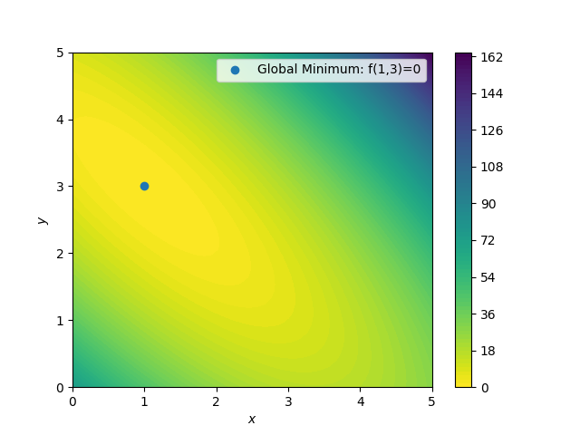

<div align="center">
<pre>
  _____                              ____        _   _           _              
 |  __ \                            / __ \      | | (_)         (_)             
 | |__) | __ ___   ___ ___  ___ ___| |  | |_ __ | |_ _ _ __ ___  _ _______ _ __ 
 |  ___/ '__/ _ \ / __/ _ \/ __/ __| |  | | '_ \| __| | '_ ` _ \| |_  / _ \ '__|
 | |   | | | (_) | (_|  __/\__ \__ \ |__| | |_) | |_| | | | | | | |/ /  __/ |   
 |_|   |_|  \___/ \___\___||___/___/\____/| .__/ \__|_|_| |_| |_|_/___\___|_|   
                                          | |                                   
                                          |_|                                   
</pre>
<a href="https://badge.fury.io/py/ProcessOptimizer"></a>
<a href="https://github.com/novonordisk-research/ProcessOptimizer/actions"></a>
<a href="https://www.python.org/"></a>
<a href="https://www.python.org/"></a>
<a href="https://github.com/novonordisk-research/ProcessOptimizer/blob/develop/LICENSE.md"></a>
<a href="https://scikit-optimize.github.io/stable/"></a>

[](https://pepy.tech/project/processoptimizer)
</div>

----------
This readme.md is work in progress

## Table of Contents
 * [ProcessOptimizer](https://github.com/novonordisk-research/ProcessOptimizer/blob/develop/README.md#processoptimizer)
 * [Installation](https://github.com/novonordisk-research/ProcessOptimizer/blob/develop/README.md#installation)
 * [How does it work?](https://github.com/novonordisk-research/ProcessOptimizer/blob/develop/README.md#how-does-it-work?)
 * [Contributions](https://github.com/novonordisk-research/ProcessOptimizer/blob/develop/README.md#contributions)
 * [Related work](https://github.com/novonordisk-research/ProcessOptimizer/blob/develop/README.md#related-work)
 * [PyPi](https://github.com/novonordisk-research/ProcessOptimizer/blob/develop/README.md#pypi)
 

## ProcessOptimizer

ProcessOptimizer is a fork of scikit-optimize. ProcessOptimizer will fundamentally function like scikit-optimize, 
yet developments are focussed on bringing improvements to help optimizing real world processes, like chemistry or baking.
For examples on use, checkout https://github.com/novonordisk-research/ProcessOptimizer/tree/develop/examples.

## Installation

ProcessOptimizer can be installed using `pip install ProcessOptimizer`
The repository and examples can be found at https://github.com/novonordisk-research/ProcessOptimizer
ProcessOptimizer can also be installed by running `pip install -e .` in top directory of the cloned repository.

## How does it work?

This package is intended for real world process optimization problems of black-box functions. This could e.g. be some complex chemical reaction where no reliable analytical model mapping input variables to the output is readily available. <br/>
Bayesian optimization is a great tool for optimizing black-box functions where the input space has many dimensions and the function is expensive to evaluate in terms of time and/or resources.<br/>
**Notice that this tool is designed to solve minimization problems.** It is therefore important to define the scoring function such that it turns into a minimization problem. <br/>
Below is an illustrative example of minimization of the Booth function in 2 dimensions using the `ProcessOptimizer` package. Notice that in real world applications the function would be black box (and typically the input space would have more than 2 dimensions). However, it would still be possible to evaluate the function given a set of input values and thus use the same framework for optimization. <br/>
The Booth function is a 2-dimensional function defined by [Booth Function (sfu.ca)](https://www.sfu.ca/~ssurjano/booth.html) :
```python
def Booth(x,y):
    return (x + 2*y - 7)**2 + (2*x + y - 5)**2 
```
Below is an image of the Booth function on the square  for i=1,2:




Suppose you are given the task of minimizing the function on the domain only using empirical observations and without any analytical function. <br/>
Working with the ProcessOptimizer package you simply define the `Space` and create an `Optimizer` object.<br/>
The `Space` object takes a list of dimensions which can either be `Real`, `Integer` or `Categorical`. `Real` dimensions are defined by the maximum and minimum values.<br/>
The `Optimizer` object initialized below uses GP (Gaussian Process). This means that after each step a Gaussian Process is fitted to the observations, which is used as a posterior distribution. Combined with an acquisition function the next point that should be explored can be determined. Notice that this process only takes place once n_initial_points of initial data has been aqcuired. In this case `LHS= True` (latin hypercube sampling) has been used as the initial sampling strategy for the first 6 points.
```python
SPACE = Space([Real(0,5), Real(0,5))])   

opt = Optimizer(SPACE, "GP", n_initial_points = 6, lhs=True)
```
The optimizer can now be used in steps by calling the `.ask()` function, evaluating the function at the given `Next_point` and use `.tell()` the `Optimizer` the result:
```python
Next_point = Opt.ask()
Next_eval = Booth(Next_point[0], Next_point[1])
res =Opt.tell(Next_point, Next_eval)
```
The object returned by tell contains a model of the Gaussian Process predicted mean. This model can be plotted using `plot_objective(res)`. Below is a gif of how the Gaussian Process predicted mean evolves after the first 6 initial points and until 20 points have been sampled in total.


 
Notice that this is an optimization tool and not a modelling tool. This means that the optimizer finds an approximate solution for the global minimum quickly however it does not guarantee that the Gaussian Process predicted mean is an accurate model on the entire domain.<br/>

The best observation against the number of observations can be plotted with `plot_convergence(res)`:
 


## Contributions

Feel free to play around with algorithm. Should you encounter errors while using ProcessOptimizer, please report them
at https://github.com/novonordisk-research/ProcessOptimizer/issues. <br>
To help solve the issues, please: <br>

- Provide minimal amount of code to reproduce the error
- State versions of ProcesOptimizer, sklearn, numpy, ...
- Describe the expected nehavior of the code <br>

If you would like to contribute by making anything from documentation to feature-additions, THANK YOU. Please open a pull request 
marked as *WIP* as early as possible and describe the issue you seek to solve and outline your planned solution.

## Related work

We are currently building a GUI to offer the power of Bayesian Process Optimization to non-coders. Stay tuned.

## PyPi

If you have not packaged before check out https://packaging.python.org/tutorials/packaging-projects/
To upload a new version to PyPi do the following in the root folder of the project:

- In terminal run the command "pytest" and make sure there are no errors
- Change version number in setup.py
- Change version number in ProcessOptimizer/\_\_init\_\_.py
- Remember to `pip install twine` if running in a new virtual env
- Run `python setup.py sdist bdist_wheel`
- Run `python -m twine upload dist/*` (make sure that /dist only contains relevant version)
